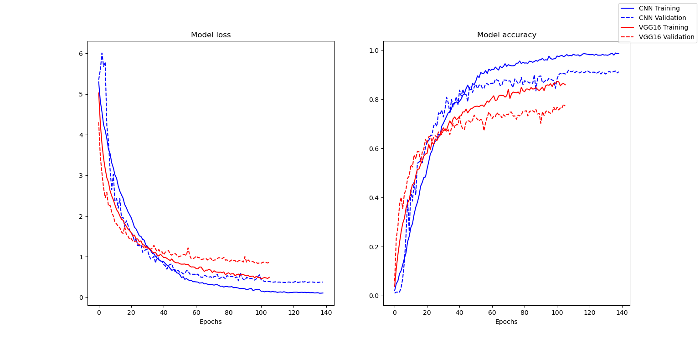

# Face recognition app

- Status: Semi-Complete (pending approval from the group)
- Update 28/12/23:
  - Val accuracy is now at 91% (see )
- Todo:
  - Train models using transfer learning
  - [____] VGG16
  - [____] ResNet
  - [____] AlexNet

## Projects description

A python programme that uses cv2 face detection with a pretrained CNN model for face recognition.
The model is trained using tensorflow libraries on a dataset comprises of 99 different labels,
each has about 10 or more images. The model should be capable of recognising human faces that
it is trained on and be able to put matching label with reasonable accuracy.
The model is trained using Google Colab T4 GPU and the weights are saved to local machine.

## CNN model

Our cnn model is based the VGG-16 model and taylored to be able to be trained on a much smaller
dataset. The model accepts 224x224x1 grayscale images as input and the output will the probability
of each image being assigned to each label. The predicted label is considered to be the label
with the highest probability.

The model consists of 8 Convolution layers with ReLu activation followed by BatchNormalization,
a Flatten layer, 2 Dense layer with ReLu and Softmax activation respectively. The model also use
the Adam optimiser with custom learning rate and SparseCategoricalCrossentropy as its loss function.
Detail about the model's architecture can be found in .

The dataset is split into two: data_train and data_test and the model is trained exclusively on
data_train. The model is then validate based on its accuracy on data_test and trained with
early escape to prevent increase in validation loss.
Detail about the model's performance can be found in .

## Dependencies

tensorflow, keras : create and load cnn model
cv2 : video capture, face detection and create app ui
cvzone : create app ui (a true life saver)

## Contents

Hust AI Projects.zip
|- Assets : Assets to create app UI
|- Faces : Some test faces
|- Models  
| |- summary.txt : summary about the model
| |- performance.png : model performance
| |- cnn_model.keras : trained CNN model
| |- cnn_weights.keras : model weights
| |- cnn_model.py : create model instance
|- Modules
| |- detect_faces.py : detect faces from an image
|- create_model.ipynb : create model from weights trained on google colab
|- face_recognition.py : main programme

## How to use

- run face_recognition.py
- press "f" to flip camera
- press "c" to capture the detected face and give prediction
- press "s" to show captured face
- press "q" to quit
